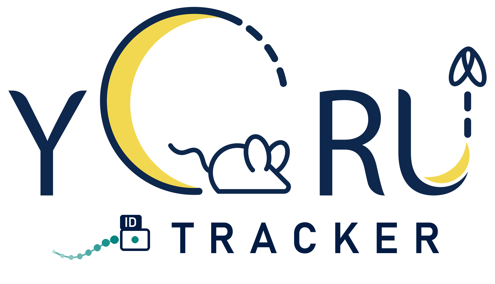

<p align="center"></p>

# YORU Tracker

Multi-animal tracking for [YORU](https://github.com/Kamikouchi-lab/YORU).
YORU detects animals and behaviours in every frame; YORU Tracker gives each
animal a persistent ID across frames, draws its trajectory, and exports
per-animal tracks — live from a camera, from a video, or for a whole folder of
videos.

It is a sister application, not a YORU plugin: it has its own window and its
own command, and the normal YORU application is unchanged by it. It uses YORU's
detectors through YORU's public API, so every model YORU can load — YOLOv5
checkpoints from YORU v1, YOLOv8/YOLO11, RT-DETR, torchvision, ONNX, oriented
boxes included — works here without conversion.

| | YORU | YORU Tracker |
|---|---|---|
| Purpose | Real-time detection, closed-loop triggers, recording | Identity, trajectories, tracking export |
| Launch | `python -m yoru` | `python -m yoru_tracker` |
| Depends on | — | YORU (≥ 2.0.0b3, < 3) |

## Install

YORU Tracker needs a YORU checkout next to it:

```text
YORU-dev/
├── YORU/            # https://github.com/Kamikouchi-lab/YORU
└── YORU-Tracker/    # this repository
```

Python 3.10 and [uv](https://docs.astral.sh/uv/):

```bash
cd YORU-Tracker
uv sync
```

This installs YORU (editable, from `../YORU`) with its CUDA build of PyTorch,
then YORU Tracker on top.

## Launch

```bash
uv run yoru-tracker          # or: uv run python -m yoru_tracker
```

The start screen offers the three workflows and the tracker settings.

**Video Tracking** — choose a video and a YORU model, press *Run tracking*. The
view follows the run; afterwards, scrub the timeline or step with ←/→ (space
plays). Every frame shows its tracks, their state, confidence, velocity and
match cost, and the events of that frame (created, lost, recovered, retired).
Overlays — track boxes, IDs, trails, raw detections, predicted boxes of lost
tracks, velocity, confidence — are toggled under the image. *Export CSV* writes
the tracks; *Render video* writes the video with the overlay. After changing
the tracker settings, *Re-track* tracks the stored detections again in seconds,
without running the model.

**Realtime Tracking** — camera (or a video played in real time, for trying
settings without an animal), model, *Start*. Left: the frame with the
detector's boxes. Right: tracks, IDs and trails. Below: active and lost IDs,
camera and detector frame rates, detector and tracker latency, capture-to-screen
latency, dropped frames, and the event log. *Start recording* writes the tracks
as they come. *Reset tracker* drops every track (IDs restart at 0) and is the
only moment new settings reach a live run; a reset while recording continues
the recording in a new file (`live_…_part2_tracks.csv`, …), so no file holds
two animals under one ID.

**Batch Tracking** — a folder of videos, one model, one output folder. Each file
gets a status row; a file that fails is reported with its error and the batch
moves on. With subfolders included, the output folder mirrors them
(`day1/fly.mp4` → `day1/fly_tracks.csv`), and videos in one folder that differ
only in their extension get it added (`fly_avi_tracks.csv`), so no result
overwrites another.

## Command line

```bash
yoru-tracker track movie.mp4 --model best.pt --out results/          # detect + track
yoru-tracker track movie.mp4 --model best.pt --out results/ --render # + overlay video
yoru-tracker track results/movie_detections.csv --config two_flies.yaml   # re-track, no GPU
yoru-tracker batch videos/ --model best.pt --out results/
yoru-tracker bench                                                    # benchmark (below)
yoru-tracker config > tracker.yaml                                    # default settings
```

`track` also reads YORU's own detection files: the video-analysis CSV and the
real-time `*_detect.csv` (with its `*_log.csv` beside it), so experiments
recorded with YORU can be tracked afterwards. In Video Tracking, *Load
detections CSV* lays such a file over its video; a real-time recording needs
its `*_log.csv` there, and frames its detector skipped are stepped over, not
counted as frames in which every animal was missed.

## Output

For `movie.mp4`:

| File | Content |
|---|---|
| `movie_tracks.csv` | One row per track per frame. |
| `movie_tracks.json` | Everything needed to reproduce the CSV: tracker name, version and API version, the full tracker configuration, detector settings, input, software versions, summary. |
| `movie_detections.csv` | The detector's output per frame (empty frames included), for re-tracking without the model. |
| `movie_tracked.mp4` | With `--render` / *Render video*. |

A row of `*_tracks.csv` begins with YORU's own detection columns, in YORU's
order, so code that reads YORU's `*_detect.csv` by position reads these rows
too; the tracking columns follow:

```text
x1 y1 x2 y2 confidence class class_name total_time cx cy w h angle
frame_id track_id track_state predicted vx vy track_confidence association_cost
```

`total_time` is the frame time in seconds, `angle` is in radians (0 for upright
boxes), `vx`/`vy` are pixels per frame. Rows for lost tracks' predicted
positions are only written when asked for (`--include-predicted`); they have
`predicted` = 1 and no `confidence`.

## Tracker settings

Settings are a versioned YAML file (`yoru-tracker config` prints the
defaults). Loading is strict: a misspelt key or an out-of-range value is an
error naming it, never a silent default. The settings most worth knowing:

| Setting | Default | Meaning |
|---|---|---|
| `lifecycle.population` | `0` | **Number of animals always in view, if known** — e.g. `2` for a pair of flies in a chamber. Then no ID is ever retired or added beyond this number, and an animal that jumps, or reappears after its partner covered it, gets its own ID back. `0`: animals may enter and leave. |
| `lifecycle.max_age` | `10` | Frames a track may go undetected and keep its ID. |
| `lifecycle.min_hits` | `2` | Detections a newcomer needs before it gets an ID, so one-frame false detections never use up a number. |
| `association.max_distance` | `100` | Pixels a detection may be from where a track is predicted to be. Scale it to your magnification. |
| `association.class_aware` | `false` | Keep `false` when classes are behaviours (`solo`, `copulation`) — an animal changes behaviour, not identity. `true` when classes are different animals. |
| `kalman.enabled` | `true` | Constant-velocity motion prediction. |

```yaml
config_version: 1
tracker:
  mode: lite
  lifecycle:
    max_age: 10
    min_hits: 2
    population: 2
  association:
    max_distance: 100.0
```

## How the Lite tracker works

Lite is an online tracker: it uses only the current frame and what it
remembers of earlier ones, runs no neural network of its own, and never
revises a decision, so it can sit in a closed loop. Per frame:

1. Predict every track's centre (Kalman filter on position and velocity, time
   in frames, so dropped camera frames are longer steps).
2. **Primary association** — every confirmed track, visible or lost, against
   the detections: gated by distance from the prediction, cost from distance,
   oriented-box IoU and long-axis agreement, solved with the Hungarian method.
3. **Recovery association** — tracks still unmatched against what is left,
   with a gate that widens the longer they have been missing.
4. Newcomers: tentative tracks, given an ID after `min_hits` sightings.
5. Unmatched tracks are LOST (still predicted); past `max_age` they are
   retired — unless the population is known, in which case a candidate seen
   `min_hits` times while every ID is taken is handed to the nearest lost track,
   together with the motion the candidate has followed since it appeared.

A lost track found again where its motion model gave it less than a 1% chance
(the animal jumped, or stopped while unseen) starts its motion afresh there,
rather than taking the distance for speed: the velocity it reports stays the
animal's.

Rectangles have no head and tail, so orientation is compared as an axis
(modulo 180°) and only for elongated boxes. The same detections in the same
order always give the same IDs, whether they come from a camera, a video or a
file — this is tested.

## Benchmark

`yoru-tracker bench` scores trackers on synthetic behavioural scenarios
(fly-sized animals, detector jitter and misses), one row per scenario —
crossings, courtship, contact, overlap, dropout, entry and exit, a jump, high
density. *Baseline* is YORU's existing frame-to-frame matching
(`match_to_previous`), called directly. *Lite+N* is Lite told the number of
animals. Seed 0:

| Scenario | Lite IDSW | Lite+N IDSW | Baseline IDSW | Lite IDF1 | Lite+N IDF1 | Baseline IDF1 |
|---|---:|---:|---:|---:|---:|---:|
| single | 0 | 0 | 2 | 0.995 | 0.995 | 0.472 |
| far_apart | 0 | 0 | 6 | 0.996 | 0.996 | 0.708 |
| fast_crossing | 0 | 0 | 4 | 0.997 | 0.997 | 0.484 |
| parallel_motion | 0 | 0 | 7 | 0.991 | 0.991 | 0.537 |
| close_approach | 0 | 0 | 7 | 0.991 | 0.991 | 0.472 |
| courtship | 0 | 0 | 5 | 0.994 | 0.994 | 0.528 |
| contact | 2 | 2 | 3 | 0.517 | 0.519 | 0.519 |
| temporary_overlap | 0 | 0 | 5 | 0.996 | 0.996 | 0.527 |
| complete_overlap | 1 | 2 | 5 | 0.758 | 0.564 | 0.429 |
| detector_dropout | 0 | 0 | 13 | 0.973 | 0.973 | 0.339 |
| animal_entry | 0 | 0 | 0 | 0.998 | 0.998 | 1.000 |
| animal_exit | 0 | 0 | 4 | 0.997 | 0.997 | 0.863 |
| high_density | 0 | 0 | 59 | 0.987 | 0.987 | 0.472 |
| obb_crossing | 0 | 0 | 6 | 0.995 | 0.995 | 0.470 |
| jump | 1 | 0 | 1 | 0.751 | 0.999 | 0.750 |
| long_contact | 1 | 0 | 1 | 0.725 | 0.895 | 0.724 |
| **total** | **5** | **4** | **128** | | | |

Lite takes about 0.15 ms per frame here — small next to any detector. The
remaining switches are animals in contact that the detector reports as one
box: which animal leaves the box on which side cannot be told from position
alone. That is the job of the planned Advanced tracker.

On a real recording — two flies, 9002 frames, including several minutes of
copulation during which the detector reports one box for the pair — default
Lite gave 38 IDs; with `population: 2`, exactly 2.

`tests/test_evaluation.py` holds these numbers as a regression gate: a change
that makes any scenario worse fails the tests.

## Logs

`~/.yoru/logs/yoru_tracker.log`, beside YORU's `yoru.log` (moves with
`YORU_HOME`). Every error shown in the window, every failed batch file, tracker
resets and configuration loads are written there. Per-track events are added
when `log_events: true`.

## Development

```bash
uv run pytest                                        # 180+ tests, ~10 s
YORU_TRACKER_GUI_TESTS=1 uv run pytest -m gui         # also open the real window
```

```text
src/yoru_tracker/
├── app.py            command line; no arguments opens the GUI
├── core/             public API: types, TrackerBase, TrackerConfig, TrackerInfo, registry
├── tracking/         Lite (geometry, kalman, association, lifecycle, lite_tracker), baseline
├── runtime/          YORU detector adapter, sources, video, realtime, batch, stored detections
├── drawing/          overlays
├── export/           tracks CSV, reproducibility metadata
├── evaluation/       metrics, synthetic scenarios, benchmark
└── gui/              start screen and the three workflows (DearPyGui)
```

The tracker API — data types, `TrackerBase`, configuration, plugins and
versioning — is described in [docs/api.md](docs/api.md). The architecture and
its boundaries are in the design document
(`YORU_YORU-Tracker_Architecture_Design.md`); YORU's side of the boundary is
YORU's `docs/external_api.md`.

## Status

Implemented: application, GUI and command line; YORU detector integration;
tracker API; Lite tracker with motion prediction, gating, IoU and axis cost,
Hungarian assignment, recovery, lifecycle and known-population mode; video,
realtime and batch tracking; CSV export with reproducibility metadata;
metrics and benchmark.

Next: explicit occlusion state for Lite (detecting merged boxes), then the
Advanced tracker (appearance-based re-identification when identities are
ambiguous), then offline refinement (gap filling, smoothing).

## License

AGPL-3.0-or-later, as YORU. See [LICENSE](LICENSE).
